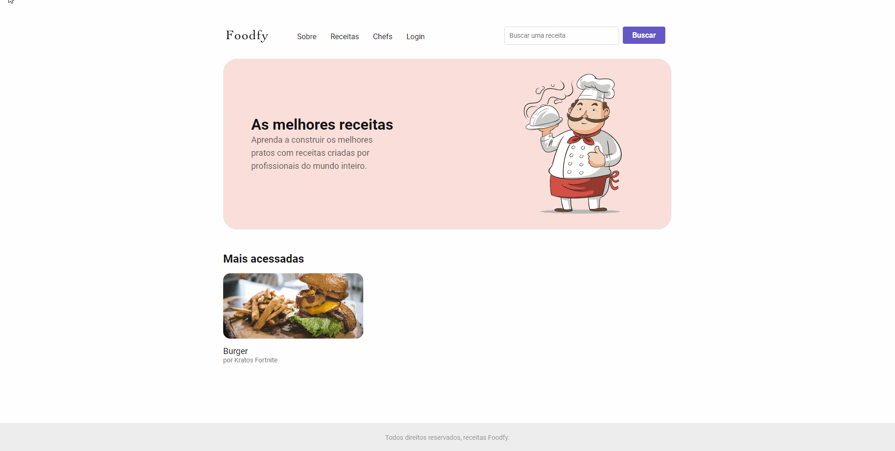
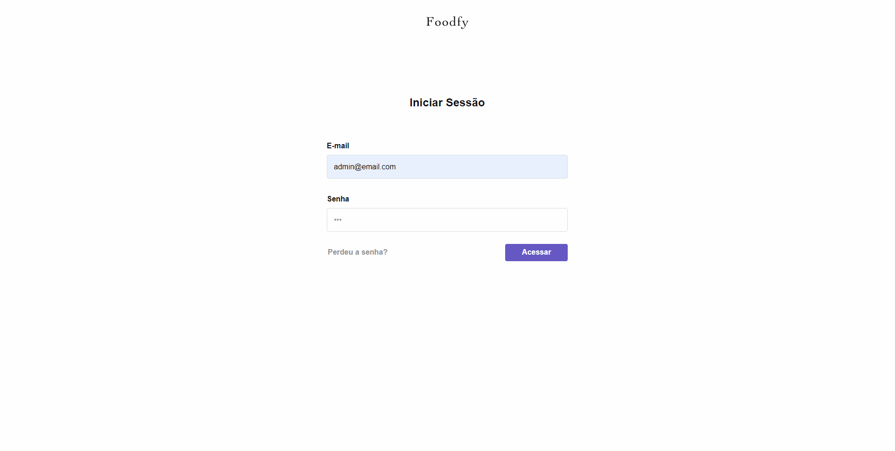

# Launchbase-Foodfy

<body>
   <ul>
   <h3>Projeto</h3>
   <li>Desafio da <a href="https://rocketseat.com.br/">Rocketseat</a>, criar um site de receitas.</li>
   <li>Um projeto que consiste em desenvolver um site de cúlinaria, parte admnistrativa, com gerenciamento de usuários), baseado em tecnologias que fazem sentido juntas.</li>
   </ul>
</body>

------


<h3 align="center">Página inicial</h3>
<p align="center">
  
</p>

<h3 align="center">Página de admin</h3>
<p align="center">
  
</p>

------


## Tecnologias que utilizei no projeto

As seguintes tecnologias foram utilizadas no desenvolvimento do projeto:

- [HTML](https://devdocs.io/html/)
- [CSS](https://devdocs.io/css/)
- [JavaScript](https://devdocs.io/javascript/)
- [Nunjucks](https://mozilla.github.io/nunjucks/)
- [NodeJS](https://nodejs.org/en/)
- [Nodemailer](https://nodemailer.com/about/)
- [Express](https://expressjs.com/)
- [Express Session](https://github.com/expressjs/session)
- [Multer](https://github.com/expressjs/multer)
- [PostgreSQL](https://www.postgresql.org/)
- [BcryptJS](https://github.com/dcodeIO/bcrypt.js)

<br>


## Dependências de desenvolvimento
* [Browsersync](https://github.com/BrowserSync/browser-sync)
* [Nodemon](https://github.com/remy/nodemon)
* [npm-run-all](https://github.com/mysticatea/npm-run-all)


<br>


## Softwares necessários
* Editor de código-fonte
* Node.js
* PostgreSQL
* Git

<br>

## Instalação
```bash
# Clone o repositório
$ git clone https://github.com/hakiso/Launchbase-Foodfy.git

# Acesse o diretório
$ cd Launchbase-Foodfy

# Instale as dependências
$ npm install
```

<br>

## Criação do banco de dados
Em seu PostgreSQL execute o arquivo `database.sql` localizado na pasta raiz do projeto para criar o banco de dados, tabelas e popular.

Acesse o arquivo `db.js` em `src/config/db.js` e configure o usuário e senha de conexão com o PostgreSQL.

```js
const { Pool } = require("pg")

module.exports = new Pool ({
    user: 'postgres',
    password: "postgres",
    host: "localhost",
    port: 5432,
    database: "foodfy"
})
```

<br>


## Recebimento de e-mails
Para testar o envio de e-mails é necessário ter uma conta no [Mailtrap](https://mailtrap.io/).

Acesse o arquivo `mailer.js` em `src/lib/` e configure o usuário e senha de conexão com o Mailtrap.
```js
module.exports = nodemailer.createTransport({
    host: "smtp.mailtrap.io",
    port: 2525,
    auth: {
        // user: "Usuário Mailtrap.io",
        // pass: "Senha Mailtrap.io",
    }
});
```

<br>

## Executando o sistema
```bash
# Inicie o servidor
$ npm start
```

<br>


## Testes
Para usar o sistema como usuário cadastrado acesse:
```
http://localhost:3000/admin/users/login
```

Para acessar o sistema como administrador:
```
E-mail: admin@email.com
Senha: 123
```

Para acessar o sistema como usuário comum:
```
E-mail: user@email.com
Senha: 123
```

<br>
